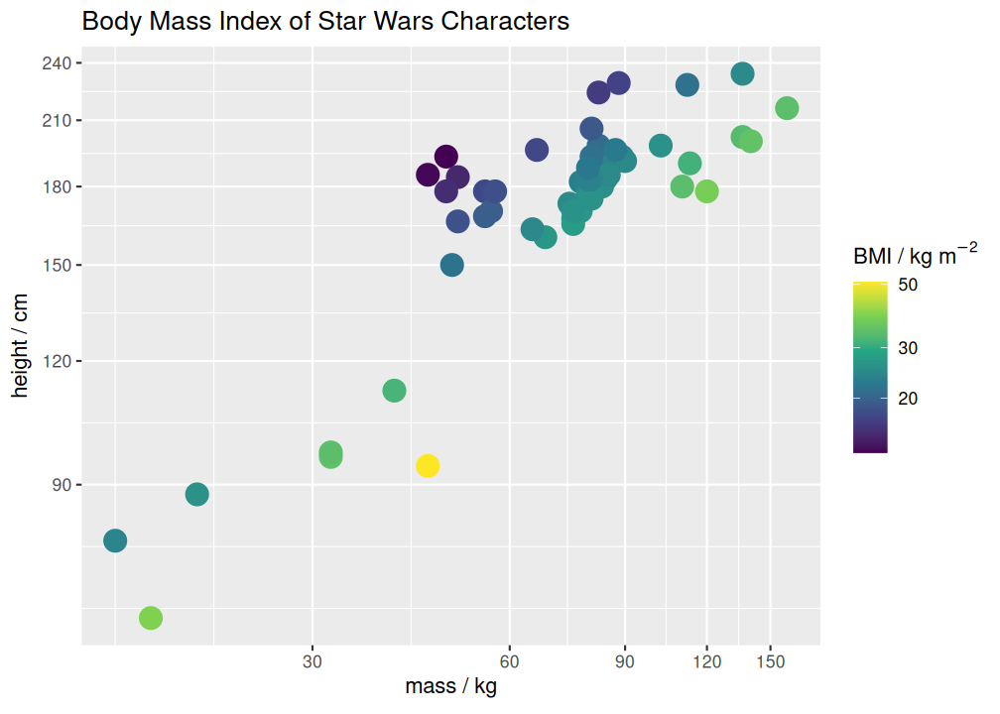

<!-- README.md is generated from README.Rmd. Please edit that file -->

# measure

<!-- badges: start -->

<!-- badges: end -->

The goal of measure is to integrate automatic unit handling into data
analysis workflows.

## Installation

You can install measure with the following command:

``` r
install.packages("measure")
```

You can install the development version of measure like so:

``` r
# install.packages("devtools")
devtools::install_github("hrryt/measure")
```

## Example

``` r
library(tidyverse)
library(measure)
```

Use `measure()` to make new `measure` objects and to convert between
units.

Units are handled for you when carrying out arithmetic operations.

``` r
bodyindex <- starwars |>
  mutate(
    mass = measure(mass, "kg"), # add units to a measurement
    height = measure(height, "c|m"), # vertical bar indicates SI prefix
    bmi0 = mass / height^2, # arithmetic operators preserve units
    bmi = measure(bmi0, "kg m^-2") # convert units
  ) |>
  select(name:mass, bmi0:bmi)

bodyindex |> arrange(desc(mass))
```

<div class="sourceCode">

<pre class="sourceCode"><code class="sourceCode">#&gt; <span style='color: #555555;'># A tibble: 87 × 5</span>
#&gt;    name                     height      mass             bmi0           bmi
#&gt;    <span style='color: #555555; font-style: italic;'>&lt;chr&gt;</span>                 <span style='color: #555555; font-style: italic;'>&lt;measure&gt;</span> <span style='color: #555555; font-style: italic;'>&lt;measure&gt;</span>        <span style='color: #555555; font-style: italic;'>&lt;measure&gt;</span>     <span style='color: #555555; font-style: italic;'>&lt;measure&gt;</span>
#&gt; <span style='color: #555555;'> 1</span> Jabba Desilijic Tiure    175 <span style='color: #555555;'>cm</span>   <span style='text-decoration: underline;'>1</span>358 <span style='color: #555555;'>kg</span> 0.044<span style='text-decoration: underline;'>3</span>  <span style='color: #555555;'>kg cm^-2</span> 443.  <span style='color: #555555;'>kg m^-2</span>
#&gt; <span style='color: #555555;'> 2</span> Grievous                 216 <span style='color: #555555;'>cm</span>    159 <span style='color: #555555;'>kg</span> 0.003<span style='text-decoration: underline;'>41</span> <span style='color: #555555;'>kg cm^-2</span>  34.1 <span style='color: #555555;'>kg m^-2</span>
#&gt; <span style='color: #555555;'> 3</span> IG-88                    200 <span style='color: #555555;'>cm</span>    140 <span style='color: #555555;'>kg</span> 0.003<span style='text-decoration: underline;'>5</span>  <span style='color: #555555;'>kg cm^-2</span>  35   <span style='color: #555555;'>kg m^-2</span>
#&gt; <span style='color: #555555;'> 4</span> Darth Vader              202 <span style='color: #555555;'>cm</span>    136 <span style='color: #555555;'>kg</span> 0.003<span style='text-decoration: underline;'>33</span> <span style='color: #555555;'>kg cm^-2</span>  33.3 <span style='color: #555555;'>kg m^-2</span>
#&gt; <span style='color: #555555;'> 5</span> Tarfful                  234 <span style='color: #555555;'>cm</span>    136 <span style='color: #555555;'>kg</span> 0.002<span style='text-decoration: underline;'>48</span> <span style='color: #555555;'>kg cm^-2</span>  24.8 <span style='color: #555555;'>kg m^-2</span>
#&gt; <span style='color: #555555;'> 6</span> Owen Lars                178 <span style='color: #555555;'>cm</span>    120 <span style='color: #555555;'>kg</span> 0.003<span style='text-decoration: underline;'>79</span> <span style='color: #555555;'>kg cm^-2</span>  37.9 <span style='color: #555555;'>kg m^-2</span>
#&gt; <span style='color: #555555;'> 7</span> Bossk                    190 <span style='color: #555555;'>cm</span>    113 <span style='color: #555555;'>kg</span> 0.003<span style='text-decoration: underline;'>13</span> <span style='color: #555555;'>kg cm^-2</span>  31.3 <span style='color: #555555;'>kg m^-2</span>
#&gt; <span style='color: #555555;'> 8</span> Chewbacca                228 <span style='color: #555555;'>cm</span>    112 <span style='color: #555555;'>kg</span> 0.002<span style='text-decoration: underline;'>15</span> <span style='color: #555555;'>kg cm^-2</span>  21.5 <span style='color: #555555;'>kg m^-2</span>
#&gt; <span style='color: #555555;'> 9</span> Jek Tono Porkins         180 <span style='color: #555555;'>cm</span>    110 <span style='color: #555555;'>kg</span> 0.003<span style='text-decoration: underline;'>40</span> <span style='color: #555555;'>kg cm^-2</span>  34.0 <span style='color: #555555;'>kg m^-2</span>
#&gt; <span style='color: #555555;'>10</span> Dexter Jettster          198 <span style='color: #555555;'>cm</span>    102 <span style='color: #555555;'>kg</span> 0.002<span style='text-decoration: underline;'>60</span> <span style='color: #555555;'>kg cm^-2</span>  26.0 <span style='color: #555555;'>kg m^-2</span>
#&gt; <span style='color: #555555;'># ℹ 77 more rows</span>
</code></pre>

</div>

Units are automatically annotated onto `ggplot2` plots with ‘enmeasured’
scales.

Every `ggplot2` scale has a `*_measure` equivalent.

``` r
breaks <- scales::breaks_extended(7)

bodyindex |>
  filter(mass < measure(200, "kg")) |>
  ggplot(aes(mass, height, color = bmi)) +
  geom_point(size = 5) +
  # two methods of achieving the same thing:
  scale_x_log10(breaks = breaks) |> enmeasure_scale() +
  scale_y_log10_measure(breaks = breaks) +
  # units are appended onto the label of an 'enmeasured' scale:
  scale_color_viridis_c_measure(trans = "log10") +
  labs(color = "BMI", title = "Body Mass Index of Star Wars Characters")
```



``` r
(plays <- lakers |>
  tibble() |>
  mutate(
    date = ymd(date),
    time = ms(time),
    team,
    points = measure(points, "point"),
    .keep = "used"
  ))
```

<div class="sourceCode">

<pre class="sourceCode"><code class="sourceCode">#&gt; <span style='color: #555555;'># A tibble: 34,624 × 4</span>
#&gt;    date       time     team     points
#&gt;    <span style='color: #555555; font-style: italic;'>&lt;date&gt;</span>     <span style='color: #555555; font-style: italic;'>&lt;Period&gt;</span> <span style='color: #555555; font-style: italic;'>&lt;chr&gt;</span> <span style='color: #555555; font-style: italic;'>&lt;measure&gt;</span>
#&gt; <span style='color: #555555;'> 1</span> 2008-10-28 12M 0S   OFF     0 <span style='color: #555555;'>point</span>
#&gt; <span style='color: #555555;'> 2</span> 2008-10-28 11M 39S  LAL     0 <span style='color: #555555;'>point</span>
#&gt; <span style='color: #555555;'> 3</span> 2008-10-28 11M 37S  LAL     0 <span style='color: #555555;'>point</span>
#&gt; <span style='color: #555555;'> 4</span> 2008-10-28 11M 25S  LAL     0 <span style='color: #555555;'>point</span>
#&gt; <span style='color: #555555;'> 5</span> 2008-10-28 11M 23S  LAL     0 <span style='color: #555555;'>point</span>
#&gt; <span style='color: #555555;'> 6</span> 2008-10-28 11M 22S  LAL     2 <span style='color: #555555;'>point</span>
#&gt; <span style='color: #555555;'> 7</span> 2008-10-28 11M 22S  POR     0 <span style='color: #555555;'>point</span>
#&gt; <span style='color: #555555;'> 8</span> 2008-10-28 11M 22S  LAL     1 <span style='color: #555555;'>point</span>
#&gt; <span style='color: #555555;'> 9</span> 2008-10-28 11M 0S   LAL     0 <span style='color: #555555;'>point</span>
#&gt; <span style='color: #555555;'>10</span> 2008-10-28 10M 53S  POR     2 <span style='color: #555555;'>point</span>
#&gt; <span style='color: #555555;'># ℹ 34,614 more rows</span>
</code></pre>

</div>

`measure` works seamlessly with `difftime` and `hms` objects, and
`lubridate` periods, intervals and durations.

Unlike most time objects, `measure` units are preserved through summary
functions.

``` r
plays |>
  mutate(time = measure(time, "min")) |>
  group_by(date, team) |>
  summarise(
    time = max(time),
    points = sum(points),
    rate = points / time,
    .groups = "keep"
  ) |>
  group_by(team) |>
  summarise(
    time = first(time),
    points = mean(points),
    rate = median(rate)
  )
```

<div class="sourceCode">

<pre class="sourceCode"><code class="sourceCode">#&gt; <span style='color: #555555;'># A tibble: 31 × 4</span>
#&gt;    team       time      points              rate
#&gt;    <span style='color: #555555; font-style: italic;'>&lt;chr&gt;</span> <span style='color: #555555; font-style: italic;'>&lt;measure&gt;</span>   <span style='color: #555555; font-style: italic;'>&lt;measure&gt;</span>         <span style='color: #555555; font-style: italic;'>&lt;measure&gt;</span>
#&gt; <span style='color: #555555;'> 1</span> ATL    11.7 <span style='color: #555555;'>min</span>  84.5 <span style='color: #555555;'>point</span> 7.21 <span style='color: #555555;'>point min^-1</span>
#&gt; <span style='color: #555555;'> 2</span> BOS    11.8 <span style='color: #555555;'>min</span>  96   <span style='color: #555555;'>point</span> 8.13 <span style='color: #555555;'>point min^-1</span>
#&gt; <span style='color: #555555;'> 3</span> CHA    11.8 <span style='color: #555555;'>min</span>  94   <span style='color: #555555;'>point</span> 7.93 <span style='color: #555555;'>point min^-1</span>
#&gt; <span style='color: #555555;'> 4</span> CHI    11.7 <span style='color: #555555;'>min</span> 109   <span style='color: #555555;'>point</span> 9.26 <span style='color: #555555;'>point min^-1</span>
#&gt; <span style='color: #555555;'> 5</span> CLE    11.8 <span style='color: #555555;'>min</span>  89.5 <span style='color: #555555;'>point</span> 7.63 <span style='color: #555555;'>point min^-1</span>
#&gt; <span style='color: #555555;'> 6</span> DAL    11.9 <span style='color: #555555;'>min</span> 102   <span style='color: #555555;'>point</span> 8.45 <span style='color: #555555;'>point min^-1</span>
#&gt; <span style='color: #555555;'> 7</span> DEN    11.8 <span style='color: #555555;'>min</span>  92.5 <span style='color: #555555;'>point</span> 7.92 <span style='color: #555555;'>point min^-1</span>
#&gt; <span style='color: #555555;'> 8</span> DET    11.8 <span style='color: #555555;'>min</span>  91.5 <span style='color: #555555;'>point</span> 7.76 <span style='color: #555555;'>point min^-1</span>
#&gt; <span style='color: #555555;'> 9</span> GSW    11.8 <span style='color: #555555;'>min</span> 111   <span style='color: #555555;'>point</span> 9.01 <span style='color: #555555;'>point min^-1</span>
#&gt; <span style='color: #555555;'>10</span> HOU    11.8 <span style='color: #555555;'>min</span>  89.8 <span style='color: #555555;'>point</span> 7.55 <span style='color: #555555;'>point min^-1</span>
#&gt; <span style='color: #555555;'># ℹ 21 more rows</span>
</code></pre>

</div>
